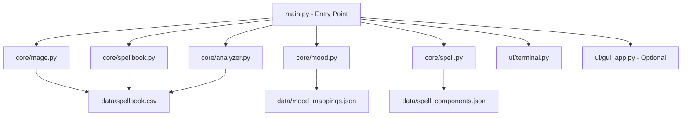
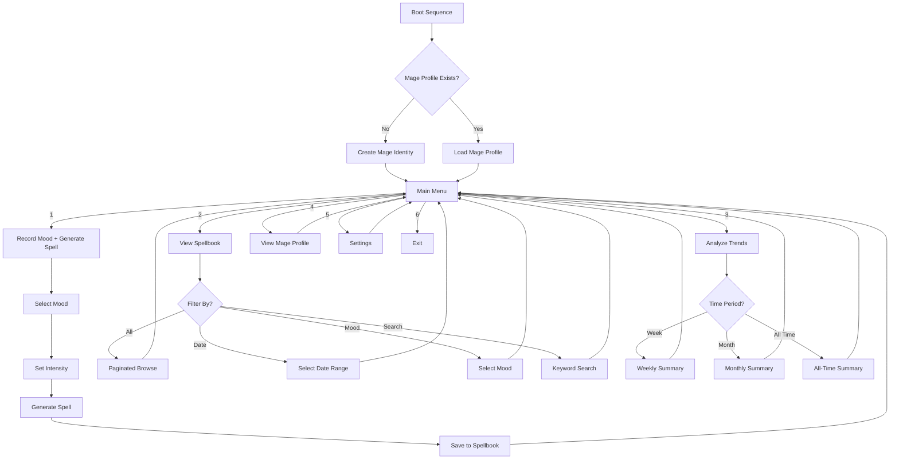

# SoulScript.exe — Project Brainstorm & Architecture Plan

## 1. Project Vision

SoulScript.exe is a terminal-themed Python application that translates daily emotional states into magical outputs. It treats feelings as inputs that can be "compiled" into spells, combining mood tracking, fantasy spell generation, and a digital spellbook into one interactive experience.

---

## 2. Core Features Breakdown

### 2.1 Mage Identity System
- On first launch, the user creates a **Mage Profile**
- Attributes: Mage Name, Title (randomly assigned or chosen), Element (derived from personality quiz or random), Familiar (spirit animal companion)
- The identity persists across sessions and personalizes spell output

### 2.2 Mood Recording & Spell Generation
- User selects or types their current emotional state
- The system maps the mood to magical properties and generates a unique spell
- Each spell has: Name, Incantation, Element, Power Level, Duration, Effect Description
- Spells are procedurally generated using mood as a seed

### 2.3 Digital Spellbook (Persistent Storage)
- All entries saved to a CSV file
- Each entry includes: Date, Time, Mood, Spell Name, Element, Power Level, Full Spell Text
- Users can browse, search, and filter their spellbook

### 2.4 Data Analysis & Emotional Trends
- Most common mood over a time period
- Mood frequency distribution
- Element distribution (which elements dominate your emotional history)
- Streak tracking (consecutive days of same mood category)
- Simple text-based charts or graphs

### 2.5 Terminal Aesthetic
- ASCII art banners and decorations
- Typing animation effects for spell generation
- Color-coded output (using `colorama` or ANSI escape codes)
- Retro boot-up sequence on launch

### 2.6 Optional Tkinter GUI
- Styled to look like a retro terminal (dark background, green/amber text, monospace font)
- Same functionality as CLI but with buttons and scrollable text areas
- Maintains the ".exe" aesthetic

---

## 3. Architecture Overview



---

## 4. Proposed File Structure

```
SoulScriptexe/
├── main.py                    # Entry point - launches CLI or GUI
├── requirements.txt           # Dependencies (colorama, etc.)
├── README.md                  # Project documentation
├── data/
│   ├── spellbook.csv          # Persistent spell/entry storage
│   ├── mage_profile.json      # Saved mage identity
│   ├── spell_components.json  # Spell name parts, incantation words, effects
│   └── mood_mappings.json     # Mood-to-element and mood-to-magic mappings
├── core/
│   ├── __init__.py
│   ├── mage.py                # MageIdentity class
│   ├── mood.py                # MoodTracker class
│   ├── spell.py               # Spell and SpellGenerator classes
│   ├── spellbook.py           # Spellbook (file I/O) class
│   └── analyzer.py            # DataAnalyzer class
├── ui/
│   ├── __init__.py
│   ├── terminal.py            # Terminal UI (CLI) with colors and effects
│   ├── gui_app.py             # Optional Tkinter GUI
│   └── ascii_art.py           # ASCII art banners and decorations
└── plans/
    └── soulscript-brainstorm.md  # This file
```

---

## 5. Class Design

### 5.1 `MageIdentity` (core/mage.py)
```
Fields:
  - name: str
  - title: str              # e.g. "the Wanderer", "of the Crimson Veil"
  - element: str            # Fire, Water, Earth, Air, Shadow, Light, Void
  - familiar: str           # e.g. "Phoenix", "Shadow Cat", "Crystal Owl"
  - creation_date: str

Methods:
  - create_new()            # Interactive mage creation
  - load()                  # Load from mage_profile.json
  - save()                  # Save to mage_profile.json
  - display_title_card()    # Show formatted mage identity
  - to_dict()               # Serialize to dictionary
```

### 5.2 `MoodTracker` (core/mood.py)
```
Fields:
  - mood_categories: dict   # Mapping of mood names to categories
  - selected_mood: str
  - intensity: int          # 1-10 scale

Methods:
  - display_mood_menu()     # Show categories with example moods as guide
  - get_mood_input()        # Accept and validate mood selection
  - get_intensity()         # Ask for mood intensity
  - categorize_mood()       # Map specific mood to broader category
```

**Mood Menu Display Format:**
The mood menu shows each category with its example moods in parentheses, so users can quickly identify which category fits their current state:

```
╔══════════════════════════════════════════════════╗
║          What stirs within your soul?            ║
╠══════════════════════════════════════════════════╣
║  1. Joyful     (happy, excited, euphoric,        ║
║                 grateful)                         ║
║  2. Melancholy (sad, lonely, nostalgic,           ║
║                 grieving)                         ║
║  3. Angry      (furious, irritated, frustrated,  ║
║                 resentful)                        ║
║  4. Anxious    (worried, nervous, overwhelmed,   ║
║                 restless)                         ║
║  5. Calm       (peaceful, serene, content,        ║
║                 relaxed, indifferent)             ║
║  6. Mysterious (curious, confused, dreamy,        ║
║                 wondering)                        ║
║  7. Dark       (hopeless, bitter, vengeful,       ║
║                 despairing)                       ║
║  8. Empowered  (confident, determined,            ║
║                 passionate, bold)                 ║
╚══════════════════════════════════════════════════╝
```

### 5.3 `Spell` (core/spell.py)
```
Fields:
  - name: str               # Generated spell name
  - incantation: str        # The spoken words
  - element: str            # Derived from mood
  - power_level: int        # Derived from mood intensity
  - duration: str           # e.g. "3 moons", "until dawn"
  - effect: str             # What the spell does
  - mood_source: str        # The mood that generated this spell
  - timestamp: str          # When it was created

Methods:
  - __str__()               # Full formatted spell display
  - to_dict()               # Serialize for CSV storage
  - display_short()         # Abbreviated one-line display
```

### 5.4 `SpellGenerator` (core/spell.py)
```
Fields:
  - components: dict        # Loaded from spell_components.json
  - mood_map: dict          # Loaded from mood_mappings.json

Methods:
  - generate(mood, intensity, mage) -> Spell
  - _build_name(element, mood)
  - _build_incantation(element, power_level)
  - _build_effect(element, mood, power_level)
  - _determine_duration(power_level)
```

### 5.5 `Spellbook` (core/spellbook.py)
```
Fields:
  - filepath: str           # Path to spellbook.csv
  - entries: list[dict]     # In-memory cache of all entries

Methods:
  - add_entry(spell, mage)  # Append a new entry
  - load_all()              # Read entire CSV into memory
  - has_entry_for_today()   # Check if a spell was already cast today
  - get_entries_by_date(range)
  - get_entries_by_mood(mood)
  - get_entries_by_element(element)
  - search(keyword)         # Free-text search
  - display_entry(entry)    # Pretty-print one entry
  - display_all()           # Paginated display of all entries
```

### 5.6 `DataAnalyzer` (core/analyzer.py)
```
Fields:
  - spellbook: Spellbook    # Reference to spellbook data

Methods:
  - most_common_mood(period)
  - mood_frequency_distribution(period)
  - element_distribution()
  - average_power_level(period)
  - mood_streaks()          # Consecutive same-mood-category days
  - generate_summary(period)
  - display_chart(data)     # Simple text-based bar chart
```

---

## 6. Mood-to-Magic Mapping System

### 6.1 Mood Categories and Elements

| Mood Category | Example Moods | Element | Spell Flavor |
|---|---|---|---|
| Joyful | Happy, Excited, Euphoric, Grateful | Air | Breezy, uplifting, soaring, freedom spells |
| Melancholy | Sad, Lonely, Nostalgic, Grieving | Light | Radiant, bittersweet, luminous, revelation spells |
| Angry | Furious, Irritated, Frustrated, Resentful | Fire | Destructive, blazing, inferno spells |
| Anxious | Worried, Nervous, Overwhelmed, Restless | Water | Flowing, tidal, turbulent, depth spells |
| Calm | Peaceful, Serene, Content, Relaxed, Indifferent | Earth | Grounding, stable, growth, fortress spells |
| Mysterious | Curious, Confused, Dreamy, Wondering | Shadow | Shrouded, elusive, whispering, twilight spells |
| Dark | Hopeless, Bitter, Vengeful, Despairing | Void | Consuming, vast, empty, eclipse, oblivion spells |
| Empowered | Confident, Determined, Passionate, Bold | Lightning | Striking, charged, thunder, storm spells |

### 6.2 Spell Generation Logic

The spell generator uses a **component-assembly** approach:

1. **Spell Name**: `[Prefix] + [Root] + [Suffix]`
   - Prefix derived from element (e.g., "Pyro", "Aqua", "Umbral")
   - Root derived from mood intensity (e.g., low="Whisper", high="Fury")
   - Suffix is a random thematic word (e.g., "Bloom", "Shatter", "Veil")

2. **Incantation**: 2-4 lines of procedurally generated pseudo-Latin/fantasy words
   - Word pools tagged by element
   - Intensity controls word length and complexity

3. **Effect Description**: Template-based with mood-specific flavor text
   - Templates like: "Channels the {element} within, causing {effect}"
   - Effect words drawn from mood-tagged pools

4. **Power Level**: Directly mapped from mood intensity (1-10)
   - 1-3: Minor Cantrip
   - 4-6: Standard Spell
   - 7-9: Powerful Incantation
   - 10: Arcane Masterwork

5. **Duration**: Semi-random, influenced by power level
   - Low: "fleeting moments" to "a single breath"
   - High: "until the next full moon" to "eternally bound"

### 6.3 Daily Spell Limit — One Cast Per Day

A core design rule: **each day, the user can generate and cast exactly one spell.** Once a spell has been logged for the current day:

- The "Record Mood + Generate Spell" menu option becomes disabled or shows a message like: *"You have already cast your daily spell. Return tomorrow when the mana flows anew."*
- The user can still access all other features: view spellbook, analyze trends, view mage profile
- The system checks the spellbook CSV for an entry with today's date on startup
- This reinforces the journaling aspect — each spell is a deliberate, once-daily reflection

**Implementation approach:**
- `Spellbook.has_entry_for_today()` method checks for current date in CSV
- `SpellGenerator.generate()` is gated behind this check
- The main menu dynamically adjusts its options based on daily spell status
- Weighted random ensures that across days, spells feel varied and non-repetitive

---

## 7. CSV Storage Schema

### spellbook.csv

```
date,time,mage_name,mage_title,element,mood,mood_category,intensity,spell_name,incantation,power_level,duration,effect
2026-04-27,22:30,Merlin,the Wanderer,Fire,Furious,Angry,8,PyroFury Inferno,"Ignis caldera vorpal flamel!",8,until dawn,"Channels the Fire within, causing enemies to tremble"
```

### mage_profile.json

```json
{
  "name": "Merlin",
  "title": "the Wanderer",
  "element": "Fire",
  "familiar": "Phoenix",
  "creation_date": "2026-04-27"
}
```

---

## 8. CLI Menu Flow



---

## 9. Optional Tkinter GUI Layout

```
+----------------------------------------------------------+
|  SoulScript.exe v1.0                           [_][口][X] |
+----------------------------------------------------------+
|                                                          |
|  ███████╗██╗  ██╗███████╗██╗  ██╗██╗   ██╗███████╗     |
|  ██╔════╝██║  ██║██╔════╝██║ ██╔╝██║   ██║██╔════╝     |
|  ███████╗███████║█████╗  █████╔╝ ██║   ██║███████╗     |
|  ╚════██║██╔══██║██╔══╝  ██╔═██╗ ██║   ██║╚════██║     |
|  ███████║██║  ██║███████╗██║  ██╗╚██████╔╝███████║     |
|  ╚══════╝╚═╝  ╚═╝╚══════╝╚═╝  ╚═╝ ╚═════╝ ╚══════╝     |
|                                                          |
|  Welcome, Merlin the Wanderer                            |
|  Element: Fire | Familiar: Phoenix                       |
|  Spells Cast: 42 | Days Active: 15                      |
|                                                          |
|  +----------------------------------------------------+  |
|  |                                                    |  |
|  |  > What is your mood, arcane one?                  |  |
|  |                                                    |  |
|  |  [Joyful] [Melancholy] [Angry] [Anxious]          |  |
|  |  [Calm]   [Mysterious] [Dark]  [Empowered]        |  |
|  |                                                    |  |
|  |  Intensity: [====------] 4/10                      |  |
|  |                                                    |  |
|  |  [Cast Spell]  [View Spellbook]  [Analyze]        |  |
|  +----------------------------------------------------+  |
|                                                          |
|  +--- Spell Output ------------------------------------+  |
|  |                                                    |  |
|  |  Spell: PyroWhisper Emberveil                      |  |
|  |  Element: Fire | Power: 4 (Standard Spell)        |  |
|  |  Duration: until the stars fade                    |  |
|  |                                                    |  |
|  |  "Ignis murmur cinder veil aurum!"                 |  |
|  |                                                    |  |
|  |  Effect: Channels the Fire within,                 |  |
|  |  warming the hearts of nearby allies.              |  |
|  +----------------------------------------------------+  |
+----------------------------------------------------------+
```

- Dark background (#0a0a0a or #1a1a2e)
- Green text (#00ff41) or amber text (#ffb000) for classic terminal feel
- Monospace font (Consolas, Courier New, or similar)
- Scanline overlay effect (optional)
- Blinking cursor animation

---

## 10. Key Design Decisions to Discuss

### 10.1 Mood Input Method — ✅ DECIDED: Fixed Categories with Example Moods
- Categories displayed as a numbered list with example moods in parentheses
- User selects a category number (e.g., `5. Calm (peaceful, serene, content, relaxed, indifferent)`)
- Simple, consistent, and easy to map to elements

### 10.2 Spell Uniqueness — ✅ DECIDED: Weighted Random + Daily Limit
- **Weighted random** generation that deprioritizes recently used components
- **One spell per day limit**: once a spell is logged, generation is disabled until the next day
- Reinforces the journaling aspect — each daily spell is a deliberate reflection

### 10.3 Scope — ✅ DECIDED: Full Build (CLI + Tkinter GUI from the Start)
- Both CLI and Tkinter GUI built together from the beginning
- Core logic shared between both interfaces (no duplication)
- Tkinter GUI styled as retro terminal (dark background, green/amber monospace text)
- CLI uses `colorama` + `rich` for polished terminal output

### 10.4 Dependencies — ✅ DECIDED: colorama + rich + tkinter
- `colorama` — cross-platform terminal color support (especially Windows compatibility)
- `rich` — advanced terminal formatting (tables, panels, progress bars, markdown)
- `tkinter` — built-in Python GUI toolkit (no pip install needed)
- All other functionality uses Python standard library

---

## 11. Implementation Order (Todo List)

1. Set up project structure, `requirements.txt`, and `README.md` skeleton
2. Create data files (`spell_components.json`, `mood_mappings.json`)
3. Implement `MageIdentity` class with save/load (`core/mage.py`)
4. Implement `MoodTracker` class with category menu (`core/mood.py`)
5. Implement `Spell` and `SpellGenerator` classes with weighted random (`core/spell.py`)
6. Implement `Spellbook` class with CSV read/write and daily spell check (`core/spellbook.py`)
7. Implement `DataAnalyzer` class with trend analysis (`core/analyzer.py`)
8. Create ASCII art assets and decorations (`ui/ascii_art.py`)
9. Build CLI terminal UI with rich/colorama formatting (`ui/terminal.py`)
10. Build Tkinter GUI with retro terminal styling (`ui/gui_app.py`)
11. Create `main.py` entry point with interface selection (CLI vs GUI)
12. Testing, polish, and final documentation
